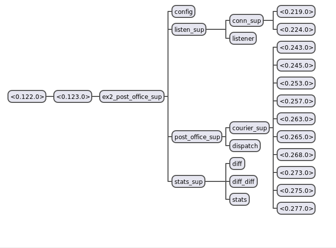

# Erlang Design Workshop, LESSON 2. Supervision Tree

Recommended read: 

[Throwing exceptions vs returning a tuple {error, Reason}](RETURN_OR_THROW.md)

[It's all about the guarantees](https://ferd.ca/it-s-about-the-guarantees.html)

[Building applications with OTP](https://learnyousomeerlang.com/building-applications-with-otp)


Source code: [https://github.com/max-au/ex2_post_office]

For this exercise, let's build a post office application. It has a
dispatcher, and some number of couriers. It takes a bit of time to
hire a courier, and a courier agrees to work for some unspecified amount
of time, gracefully resigning afterwards. Sometimes couriers run out
of patience (after delivering a number of parcels), and this leads to
abrupt contract termination.

Use ```rebar3 shell``` to take a peek at application internals:

    $ rebar3 shell

Changing logging level for readability:

    logger:set_primary_config(level, warning).
    logger:set_primary_config(level, error).
    logger:set_primary_config(level, notice).

To send parcels, connect using telnet:

    $ telnet localhost 9999
    > Name Sender
    > Do 14
    
Server accepts two commands, ```Name NewName``` (to illustrate restarts
without losing socket) and ```Do N``` (where N is a number of parcels to
send).

    Name myname
    Do 12
    
"Name" command changes the name of the client, and "Do" just sends a
number of parcels. If a client gives any other command, staff leads him
out of the office and welcomes back, restarting communication flow
(but does not lose TCP connection).

## Supervisor behaviour

*A lot of times, when people think of Erlang supervisors, they think 
of restarts. <...> Still, supervisors aren't just about restarting.* - Fred Hebert

Concepts behind supervision:
 * startup and shutdown **order**
 * availability guarantees
 * state provisioning
 * crash/failure domains
 
### Startup order
Application supervision tree is always constructed in a specific order,
supplied by Supervisor:init/1. Initialisation is sequential and
synchronous. If child fails during initialisation stage, supervisor also
fails, and rest of the children are never born.

Post office application reads configuration from disk. No other process
can start until configuration is read and made available. 

To express this behaviour, 'config' child gen_server is added first to 
top-level supervisor:

    #{id => config, start => {config, start_link, []}, modules => [config]}

OTP guarantees shutdown sequence to be the exact opposite of startup.
Thus 'config' server is guaranteed to be available for the entire
lifespan of all other children of the supervisor.

To observe the behaviour, just start the shell:

    $ rebar3 shell
    2019-04-28T21:42:36.159901-07:00 notice: Waiting for couriers, have 3 and need 4
    (...)
    2019-04-28T21:42:37.146260-07:00 notice: diff_diff <...)
    ===> Booted ex2_post_office
    2019-04-28T21:42:38.140710-07:00

Note that application has not been booted until at least 4 couriers 
have been hired and reported to dispatcher.

### Availability guarantees

Supervised process expresses *guarantees* in the initialisation stage
(init/1 callback). For the example above, when 'config' gen_server
completes initialisation, it *guarantees* configuration availability
from now on. 
Since is is also guaranteed that files on disk are always available,
'config' server restart guaranteed to be successful. When guarantees 
are broken (e.g. file is removed), system cannot start from the good
known state, and must be shut down. OTP implements this behaviour for 
us.

    (Ctrl + C (to exit rebar3 shell))
    $ chmod -r _build/default/lib/ex2_post_office/priv/config 
    $ rebar3 shell
    (watch application not starting)
    $ chmod +r _build/default/lib/ex2_post_office/priv/config
    (note that application starts)

Similar approach applies to network connections. If reconnection attempt
is *guaranteed* to be successful, it should be expressed by using 
```gen_tcp:connect``` in ```init/1``` of your server.

When it's *expected* to be temporary unavailable, your gen_server should
implement a different approach. It may attempt to open the connection 
in init/1, but it must not wait or fail in init/1. It should retry if
connection attempt is not successful. For this example, couriers are 
not hired in init/1 stage, because there is no success guarantee. 

    $ rebar3 shell
    (until preconfigured amount of couriers is hired, 
        telnet localhost 9999 responds with "Connection refused")

Application may need to spin up a pool of network connections before
starting to serve actual requests. For example, start TCP listener only
when a pool of at least 10 database connections is available. 

To express this behaviour, init/1 callback should contain code waiting
for that *guarantee* to be executed. This technique is demonstrated by 
'listener' server, that loops waiting for preconfigured amount of
couriers to be hired before starting to listen on port.

It's also possible to implement circuit breaker pattern using this 
technique, by crashing listener process when number of connections falls
below predefined amount. Since listener restart policy is set to 
'permanent', supervisor attempts to restart the listener. Which, in
turn, waits until predefined amount of couriers is available.

### Static state provisioning

Child specification includes ```start``` parameter, that defines static
state ('known good', or initial state) of the child. 

In this example, connection supervisor provides a TCP socket to start
with. Connection process is declared as ```transient``` child, which
means it is to be restarted after erratic termination. Connection
process treats TCP 'close' request to be graceful shutdown, and 
supervisor does not restart a connection in this case. However when
connection process crashes for any other reason (invalid user input
being one of them), supervisor restarts a connection with the same 
socket, bringing it back to "welcome" line. 

     (experience restart policy: make 2 separate TCP connections, and
      then crash the entire supervisor with crashing one of the 
      connections 2 times in less than 10 seconds by just sending
      empty line)

### State provisioning - dependencies between processes

Let's add some statistics to our application. Count number of parcels
delivered, total number of gracefully resigned couriers, total amount
of patience ever reported by all couriers. Let's also run some advanced
reporting: every second a difference between previous and current 
value is reported, and also a derivative of this (e.g. velocity of
the change).

One process (stats) will be responsible for statistics collection,
simply bumping counters should the need arise.

Second process (diff) collects current counters once a second, and 
calculates difference between previously collected value, and a current
one.

Third process (diff_diff) calculates derivative based on second process
samples.

    2019-04-28T21:29:39.155685-07:00 notice: diff: #{patience => 5,resign => 0,tasks => 0}
    2019-04-28T21:29:39.156103-07:00 notice: diff_diff: #{patience => 5,resign => 0,tasks => 0}
    2019-04-28T21:29:40.157004-07:00 notice: diff_diff: #{patience => -5,resign => 0,tasks => 0}

How to read it: between 29:38 and 29:39, 'patience' counter was bumped 5
points. This led to the same amount in derivative (speed of change was
up 5 points). Next second (39 -> 40) there was no bump, so speed dropped
back to zero (change is -5).

There is a clear dependency of ```diff_diff``` on ```diff```, and 
```diff``` on ```stats```. If, for whatever reason, ```diff``` crashes,
```diff_diff``` must also be restarted. If ```stats``` crashes, both
dependent processes must be restarted.

This is implemented with ```rest_for_one``` supervisor strategy. OTP
restarts all processes starting after the one that crashed.
 
    > exit(stats, kill).

Command above terminates stats collection server, triggering restarts
of both diff and diff_diff servers.

### Failure domains

Statistics collection is important, but not critical. It's totally fine
to continue without counting, until an educated person recovers
collection routine.

Declaring stats_sup ```transient``` does the trick. If any of its 
children restarts too often due to a permanent error, we do not want
to crash the entire application.

To simulate the situation, run the following command in the shell:

     > stats:count(key, atom).
     
Neither diff, nor diff_diff expect atoms to be in the statistics, so
they both reach max_restart_intensity quickly:

     > supervisor:which_children(ex2_post_office_sup).
        <...>
       {stats_sup,undefined,supervisor,[stats_sup]},
        <...>

Let's have it back:

    > supervisor:restart_child(ex2_post_office_sup, stats_sup).

Same concept applies to application. When a permanent application 
terminates, all other applications and the entire Erlang node are also 
terminated. Transient application terminating abnormally also leads to
node being shut down.

Temporary application termination keeps the node running. Same applies 
to normally terminating transient application.

## Supervision tree for this example
Erlang/OTP includes [Observer](http://erlang.org/doc/apps/observer/observer_ug.html)
application implementing introspection of supervision tree.

    $ rebar3 shell
    $ > observer:start().


